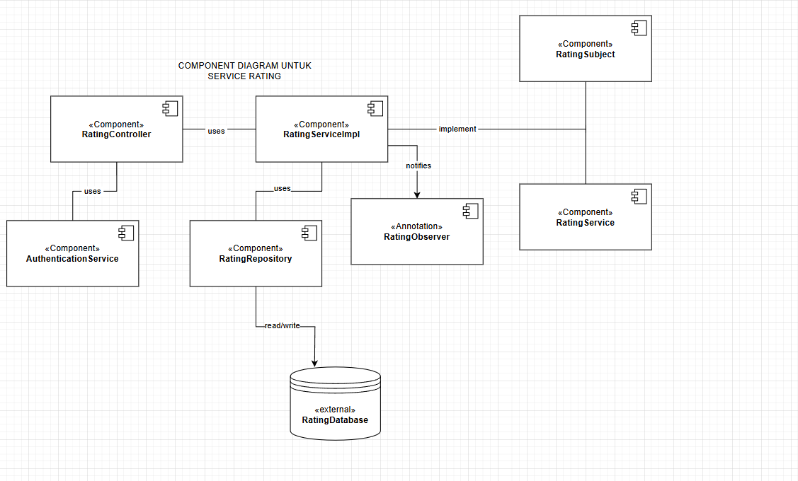
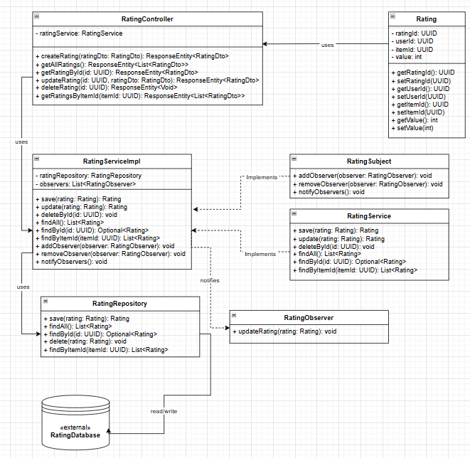

Penjelasan Pattern:
Observer Pattern, sebagaimana dijelaskan, memungkinkan komponen yang “mengamati” data untuk menerima notifikasi otomatis ketika data tersebut berubah.

Mengapa Dipilih:
Saat user memberikan atau mengubah rating, nilai rata-rata pada menu harus diperbarui secara langsung. Dengan pattern ini, komponen tampilan yang menampilkan average rating bisa langsung mendapat update saat ada perubahan pada data rating, sehingga menjaga konsistensi informasi yang tampil.

# Individual Submit: Kevin Yehezkiel Manurung - 2206826974
## 1. Component Diagram - Rating Service

## 2. Code Diagram - Rating Service
